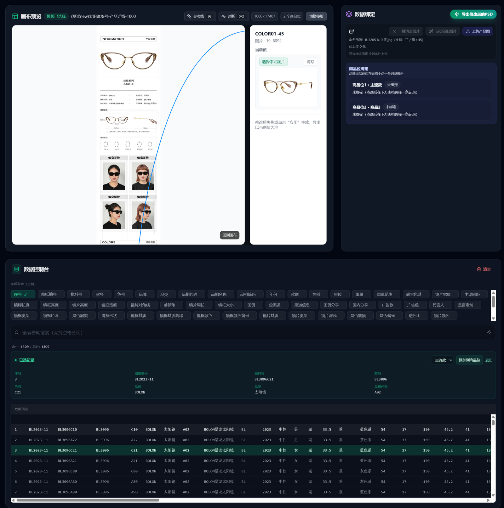

# 闪图 Fdesign V3.0

把 Excel 商品数据，一键变成批量 PSD 成品。

Turns Excel product data into batch PSD deliverables through a local Photoshop automation workbench.


闪图 Fdesign 是面向电商设计师、运营和自动化开发者的开源 PSD 图像生产工作台。你可以导入 PSD 模板，绑定 Excel 字段、商品图和规则链，再通过本机 Photoshop 批量导出 PSD、PSB、PNG 与 JPEG 成品。

如果 Fdesign 帮你少做重复图，欢迎给仓库点一个 Star，也欢迎把真实模板场景、问题和改进建议发到 Issues / Discussions。

项目页：<https://kriswd.github.io/Fdesign/>

## 产品截图



上图展示 PSD 画布预览、商品位绑定、Excel 数据控制台与导出入口的主工作流。

## 三步工作流

1. 导入 PSD 模板
2. 绑定 Excel 字段与商品图
3. 批量导出 PSD / PSB / PNG / JPEG

## 适合谁

- 电商设计师：减少重复替换商品图、文案和规格字段的机械工作。
- 电商运营：把 Excel 商品数据变成可复用的图像生产任务。
- 自动化开发者：参考 React + Node.js + Photoshop JSX/VBS 的本地自动化链路。
- 小团队与工作室：在本机保留 PSD、素材和导出结果，不依赖云端图片生产服务。

## 能力概览

- 在浏览器中解析 PSD 模板并管理可替换变量。
- 结合 Excel、图片变量和规则链生成批量任务。
- 通过 Node.js 调度 Photoshop 完成 PSD、PSB、PNG 与 JPEG 导出。
- 提供模板配置、任务模板和运行数据的本地管理能力。
- 支持公开店铺服务入口，但开源功能可直接本地运行。

## 运行要求

- Node.js 18+
- Windows 10/11 x64
- 本机已安装且可被脚本调用的 Adobe Photoshop

仓库只包含应用代码，不分发 Photoshop、字体、模板素材或运行产物。

## 快速开始

```bash
npm install
npm run server
npm run dev
```

开发访问地址：

- 前端界面：`http://127.0.0.1:3010/`
- 后端健康检查：`http://127.0.0.1:3001/health`

后端读取当前 shell 中的环境变量；前端本地变量可参考 `.env.example`。生产模式启用后台会话前，请先设置足够长的 `ADMIN_AUTH_SECRET` 并收紧允许访问的来源。

## 完整演示

- [Demo walkthrough](./docs/DEMO.md)
- [Roadmap](./docs/ROADMAP.md)
- [PSD 自动填充手册](./docs/USER_MANUAL_PSD_AUTOFILL.md)
- [V3.0 launch kit](./docs/launch/Fdesign_V3_launch_kit.md)
- [Distribution plan](./docs/launch/distribution_targets.md)
- [China growth playbook](./docs/launch/china_growth_playbook.md)

## 贡献方式

欢迎提交这些类型的贡献：

- 复现清楚的 bug report，尤其是 PSD 模板解析、Excel 字段绑定、Photoshop 导出失败。
- 真实模板/工作流案例，帮助项目沉淀更多电商图像生产场景。
- 文档、截图、快速开始和故障排查改进。
- 面向新手的 issue、示例数据和模板说明。

开始前建议先阅读 [CONTRIBUTING.md](./CONTRIBUTING.md)。如果不确定该提 Issue 还是 Discussion，可以先在 Discussions 里描述你的工作流。

## 服务入口

首页顶部默认展示“选购服务”入口，指向公开店铺：

```env
VITE_SHOP_URL=https://pay.ldxp.cn/shop/FTIWLFHQ
VITE_SHOP_LINK_LABEL=选购服务
```

开源功能可直接本地运行；需要模板定制、部署协助或成品服务时，再使用店铺入口。

如需替换入口地址，可在部署环境中覆盖 `VITE_SHOP_URL`；设置为非 `http(s)` 地址时，顶部店铺入口会自动隐藏。

## 目录

- `src/`：React 前端
- `server/`：后端 API、模板存储与 Photoshop 调度
- `server/photoshop/`：Photoshop JSX/VBS 脚本
- `tests/`：Node 测试和浏览器烟测
- `docs/`：架构、API、使用说明与公开发布资料

## 开发文档

- [架构说明](./docs/ARCHITECTURE.md)
- [API 开发指南](./docs/API_DEV_GUIDE.md)
- [PSD 自动填充手册](./docs/USER_MANUAL_PSD_AUTOFILL.md)
- [开源检查清单](./docs/OPEN_SOURCE_CHECKLIST.md)
- [分发与增长指标](./docs/launch/first_30_days_growth_plan.md)
- [国内推广作战手册](./docs/launch/china_growth_playbook.md)
- [贡献指南](./CONTRIBUTING.md)
- [安全上报](./SECURITY.md)

## 验证

```bash
npm run lint
npm run build
npm test
```

涉及 Photoshop 宿主进程、导出结果或真实页面交互时，还需要启动前后端做端到端回归。

## License

本项目基于 [MIT License](./LICENSE) 发布。
