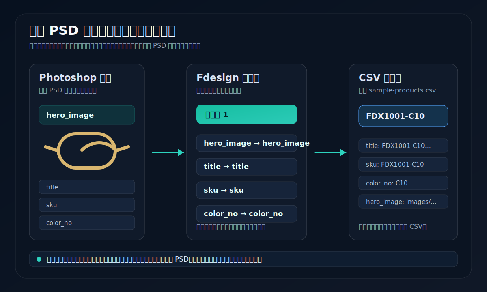

# 最小 PSD 模板制作教程

这份教程用于第一次试跑 Fdesign 时验证“Excel 字段 -> PSD 变量 -> 商品图 -> 导出”的最短链路。它不要求你拿真实模板上来测试，也不需要公开任何私有 PSD。

建议先用这份最小模板跑通一条记录，再把同样的绑定方法迁移到真实电商模板里。



上图只使用公开演示字段，表达的是最短链路：Photoshop 图层名保持为 `title`、`sku`、`color_no`、`subtitle`、`hero_image`，再在 Fdesign 里绑定到同名 CSV 字段。

## 需要准备

- Windows 10/11
- 已安装并能手动打开的 Adobe Photoshop
- 已按 [中文快速试跑](../QUICKSTART_CN.md) 启动 Fdesign 前后端
- 本目录里的公开演示数据：
  - `sample-products.csv`
  - `field-map.example.json`
  - `images/FDX1001-C10-front.svg`
  - `assets/minimal-psd-binding-flow.svg`

## 1. 新建一个 PSD

在 Photoshop 中新建一个普通画布即可，例如：

- 宽度：`1000 px`
- 高度：`1400 px`
- 颜色模式：RGB
- 背景：白色

保存为本地文件，例如：

```text
D:\Projects\Fdesign-demo\fdesign-minimal-demo.psd
```

不要把这个文件提交到公开仓库。PSD 只留在你的本机。

## 2. 创建文本变量图层

在 Photoshop 里创建 4 个文本图层，并把图层名改成下面这些变量名：

| 图层名 | 初始文字 | 对应 CSV 字段 |
| --- | --- | --- |
| `title` | `FDX1001 C10 Optical Frame` | `title` |
| `sku` | `FDX1001-C10` | `sku` |
| `color_no` | `C10` | `color_no` |
| `subtitle` | `Lightweight demo frame` | `subtitle` |

排版不用复杂，能看清楚即可。第一版重点是验证变量绑定，不是做视觉成品。

## 3. 创建图片占位层

推荐使用 Photoshop 的“置入嵌入对象”创建图片层：

1. 选择 `文件 -> 置入嵌入对象`。
2. 选择本目录的 `images/FDX1001-C10-front.svg`，或先把它另存为你本机可用的 PNG/JPG。
3. 调整到画布中间。
4. 把置入后的图片图层命名为 `hero_image`。

如果导入后 Fdesign 没有把它识别成可替换图片变量，优先换成 PNG/JPG 再置入，不要用纯形状图层代替图片占位层。

## 4. 导入模板并创建商品位

打开 Fdesign 工作台后：

1. 进入 `PSD 自动填充`。
2. 上传刚才保存的 `fdesign-minimal-demo.psd`。
3. 进入模板配置。
4. 创建一个商品位，例如 `商品位 1`。
5. 在画布上选中 `title`、`sku`、`color_no`、`subtitle`、`hero_image` 这些变量。
6. 点击“添加到商品位”。

如果你看不到某个变量，先回 Photoshop 检查图层是否隐藏、是否真的保存到了 PSD、图层名是否和上表一致。

## 5. 绑定字段

上传或参考 `sample-products.csv` 后，把变量绑定到对应字段：

| PSD 变量 | 绑定字段 |
| --- | --- |
| `title` | `title` |
| `sku` | `sku` |
| `color_no` | `color_no` |
| `subtitle` | `subtitle` |
| `hero_image` | `hero_image` |

`field-map.example.json` 里也有同样的映射关系：

```json
{
  "textVariables": {
    "sku": "sku",
    "color_no": "color_no",
    "title": "title",
    "subtitle": "subtitle"
  },
  "imageVariables": {
    "hero_image": "hero_image"
  }
}
```

真实项目里变量名不一定要和 CSV 字段名完全相同，但第一次试跑建议保持同名，排查成本最低。

## 6. 跑一条记录

先选择 `sample-products.csv` 的第一行：

```text
FDX1001-C10
```

然后：

1. 把这一行添加到 `商品位 1`。
2. 点击自动填充或应用绑定。
3. 检查画布上的标题、SKU、色号和商品图是否变化。
4. 先导出一张 PNG 或 JPEG。
5. 再尝试导出 PSD / PSB。

如果 CSV 里的相对图片路径没有自动命中，可以先在界面里手动选择本机图片文件。最小链路跑通后，再回头整理图片路径规则。

## 7. 跑通后你应该看到什么


界面不需要和截图里的真实业务模板完全一致，但第一次试跑成功后，至少应该能看到这几个区域协同工作：

- 左侧画布预览能看到 PSD 页面和被替换后的内容。
- 中间或侧栏能看到当前图片变量，例如 `hero_image` 对应的本地图片。
- 右侧数据绑定区能看到商品位与变量绑定状态。
- 底部数据控制台能看到 CSV/Excel 字段和当前选中的记录。

如果你的界面仍停在空态，通常说明模板还没有成功入库、商品位没有建立，或数据没有被添加到商品位。先回到第 4-6 步逐项核对。

## 8. 常见卡点

### 文本没有替换

- 检查变量是否已经添加到商品位。
- 检查变量是否绑定到了正确 CSV 字段。
- 检查 Excel/CSV 表头是否和绑定字段一致。
- 保存模板配置后刷新页面再试一次。

### 图片没有替换

- 确认 `hero_image` 是图片图层或智能对象，不是普通形状层。
- 确认图片文件存在，路径能被当前电脑访问。
- 先用手动选图验证图片替换，再排查 CSV 相对路径。

### Photoshop 导出失败

- 先手动打开 Photoshop，关闭登录、更新、授权和文件恢复弹窗。
- 确认 PSD 文件没有被其它程序占用。
- 确认导出目录可写。
- 先导出 PNG/JPEG，再试 PSD/PSB。
- 仍失败时，按 [中文排障清单](../TROUBLESHOOTING_CN.md) 准备净化后的错误摘要。

## 9. 公开反馈边界

可以公开：

- 虚构字段名。
- 净化后的变量名。
- 最小复现步骤。
- 不含真实商品和客户信息的截图。
- 报错摘要和环境版本。

不要公开：

- 私有 PSD 模板。
- 真实商品图。
- 客户数据、订单、报价、账号、token。
- 店铺后台截图或授权不清的图片素材。
